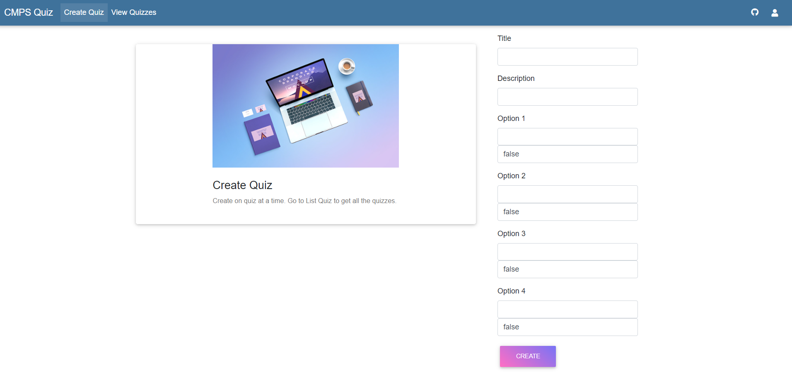

# Quiz Application REST API

## Running locally:

1.  Git Clone the Repository -
    ** git clone https://github.com/SilvinPradhan/Quiz-App-MEAN.git quiz-application-clone **
2.  Go into the Project -
    ** cd quiz-application-clone **
3.  Install the Packages in both the folders:
    ** npm install **
    ** cd quiz-app-mean **
    ** npm install **
4.  Run Server and Client Side Locally

-   For Client Side: [If you are inside the Folder(quiz-app-mean)]:
    ** ng serve -o **
-   For Server Side: [If you are inside the root folder, i.e, quiz-application-clone]:
    Open another terminal,
    // It opens the Server to test published End Points

*   Type the command in the terminal

    ** npm run server **

# Images

1.  Web View
    
